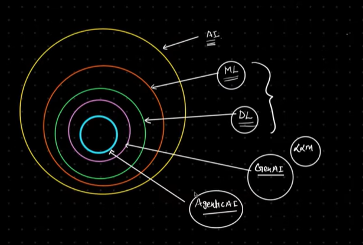

# Fundamentals:

## AI:
The broad field of creating systems that can perform tasks requiring human intelligence.  
Examples: reasoning, learning, problem-solving, perception, language understanding  
Focus: Making machines “intelligent”

## Traditional AI
### ML:
A subset of AI where systems learn patterns from data instead of being explicitly programmed.  
Examples: spam detection, recommendation systems  
Focus: Learning from data

### DL:
A subset of ML that uses neural networks with many layers to learn complex patterns.  
Examples: image recognition, speech recognition, LLMs  
Focus: Learning complex representations using neural networks

## Generative AI:
AI Systems that generate content such as text, images, or code.  
Focus: Content Creation

## Fine Tuning:
It is the process of adapting a pre-trained model to a specific task, domain, or behavior using custom data.  
Focus: Permanently modifying model behavior

## AI Assistant:
A conversational AI that responds to user queries,mostly reactive  
Example: Chatbots, FAQ bots, etc

## RAG:
A technique where AI retrieves external knowledge before generating a response.
Example: Chat with PDFs or internal document

## Agentic AI:
A decision philosophy where AI systems show autonomy, decision making & adaptive behavior.  
Focus: How agents are designed

### AI Agent (Core: Single Agent)
An AI system that can:
    - Take input
    - Decide what to do next
    - Execute actions (Tool Calls, API Calls, Response, or Delegation)
Decision-making is the define property

### Deep Agent
A highly autonomous agent with:
- Planning
- Memory
- Reflection
- Looping
- Often Human-in-the-loop
Focus: Long-Running, Self-improving autonomy

### Multi-Agent AI
A system where multiple AI agents collaborate, each with a defined role, to solve a problem.  
Focus: Coordination & teamwork

## Agentic AI Ecosystem - Core Concepts & Building Blocks
### 1. Intelligence Layer:
- LLM
- Prompt
- Thinking/Reasoning
(Chain-of-Thought, Tree-of-Thoughts - Conceptual)

### 2. Decision & Control Layer:
- Planning (steps breakdown, task ordering)
- Output Check/Evaluation (quality checks, constraint validation, rule based or LLM-based)
- Reflection (self-critique, improvement)
- Iteration/Looping (retry, self-correction)

### 3. Action Layer:
- Tool Calls (API, DB, Code Execution)
- Calling Another Agent
- Producing the Final Output 

### 4. State & Memory Layer:
- State:
    - What the agent knows right now
    - Conversation state + Task Rate
- Memory:
    - Short-term
    - Long-Term
    - Persistent (Vector DB, Files, Logs)

### 5. Safety, Reliability & Infrastructure Layer:
- Human-in-the-loop (approval, feedback, override)
- Guardrails (responsible AI, Constants)
- Context Engineering
- Checkpointing (pause, resume, recovery for long-running agents)

## Framework:
1. Langchain - Fundational Building Blocks
2. Langgraph - stateful, agentic workflow, multi-agent system
3. CrewAI / Autogen - Agentic Workflows, Multi-agent coordination
4. n8n / Langflow - Orchestration & Automation without coding
